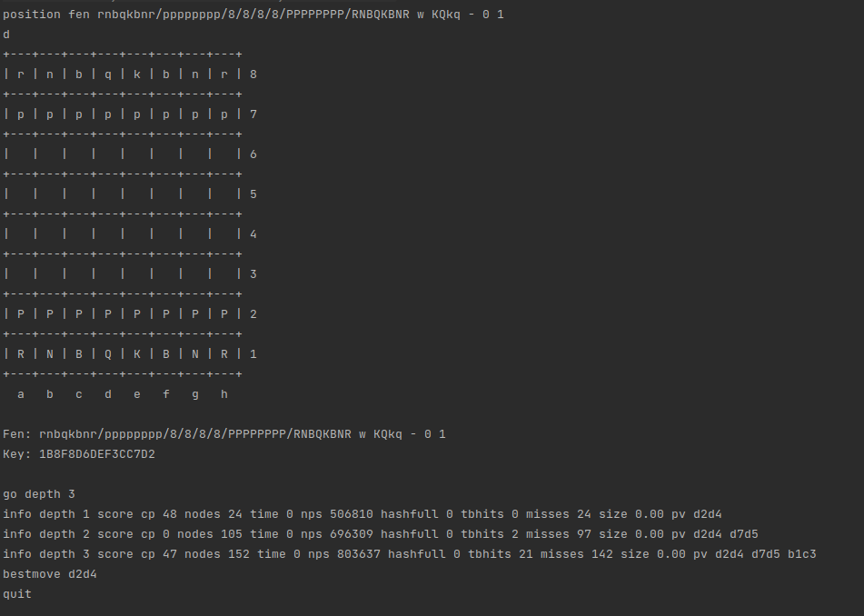

# Kelp


<p align="center">
    
</p>

Kelp is a UCI compatible chess engine written in Rust. It uses standard chess algorithms like alpha-beta pruning, PVS, LMR, Null Move Reduction, iterative deepening, quiescence search, etc.
Kelp is made to be used as a library but that is work in progress. Currently, it can be used as a UCI engine. The evaluation needs a lot of work to be done especially the endgame evaluation.

## Example

  

## Build

```bash
cargo build --release
```

## About

### Board
- A bitboard[12] array is used to represent the board. Each piece is mapped to a bitboard.
- standard make/unmake move functions are used, unmake move use move history to unmake instead of copy/take approach.

### Search
- Iterative deepening with aspiration windows.
- Negamax with alpha-beta pruning.
- Principal Variation Search.
- Late Move Reduction.
- Null Move Pruning.
- Quiescence Search.
- Transposition Table.
- Move Ordering
  - MVV-LVA
  - Killer Moves
  - History Heuristic
  - PV Table

### Evaluation
- Piece Square Tables
- Tapered Eval
- Basic King Safety
- Mobility & Basic Mop Up Evaluation
- Passed Pawns, Isolated Pawns, Doubled Pawns

### TODO
- [ ] Pawn Structure
- [ ] Endgame Evaluation
- [ ] Better King Safety and Pawn Shield
- [ ] Better Mobility
- [ ] Better Mop Up Evaluation
- [ ] fix threefold repetition completely (sometimes it doesn't work)
- [ ] fix bad evaluation and moves (sometimes it makes bad moves)
- [ ] Opening Book
- [ ] Better Move Ordering using hash ordering
- [ ] Refactor code and make modules private
- [ ] Complete Library support
- [ ] Better Time Management
- [ ] Integrate Syzygy Endgame Tablebases
- [ ] Integrate Stockfish's NNUE

## Tests

Kelp Implements some basic tests suchs as perft test, fen parsing and incremental update of zobrist hash.
Perft results are compared with [Perft Results](https://www.chessprogramming.org/Perft_Results) and incremental update of zobrist hash is compared with scratch generation of zobrist hash.

```bash
cargo test
```

## References & Resources

Resources that helped me a lot in making this engine.

- [Chess Programming Wiki](https://www.chessprogramming.org/Main_Page)
- [Vice by Bluefever Software](https://github.com/bluefeversoft/vice) and corresponfing [playlist](https://www.youtube.com/playlist?list=PLZ1QII7yudbc-Ky058TEaOstZHVbT-2hg)
- [BBC by Code Monkey King](https://github.com/maksimKorzh/bbc) and the correspponding [playlist](https://www.youtube.com/playlist?list=PLmN0neTso3Jxh8ZIylk74JpwfiWNI76Cs)
- [Pleco Chess Engine](https://github.com/pleco-rs/Pleco)
- [Chess-rs Chess Engine](https://github.com/ParthPant/chess-rs)
- [Fruit Chess Engine](https://github.com/Warpten/Fruit-2.1)
- [codefish Chess Engine](https://github.com/jsilll/codfish)
- [TSCP Chess Engine](http://www.tckerrigan.com/Chess/TSCP/)

## License
Kelp is licensed under the GNU General Public License v3.0. See [LICENSE](LICENSE) for details.